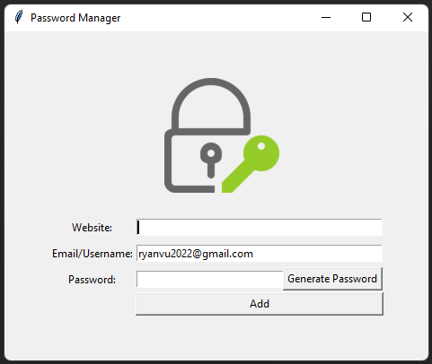

# password-manager
A password manager to generate (optional) and save password locally for personal use.  

The application is built with Python, Tkinter for GUI, and pyperclip.  
- User can fill in website, email/username(default with custom email) and password.
- Password can be filled manually or generated by clicking "Generate Password" button.
- When "Generate Password" button is clicked, pyperclip will automatically copy the password to clipboard.
- When "Add" button is clicked, a message box (from Tkinter) will pop up to ask user to confirm information.
- If user clicks "Ok", then info will be saved to a text file.
- "Add" button only works if none of three inputs is empty, otherwise a warning message will pop up.

