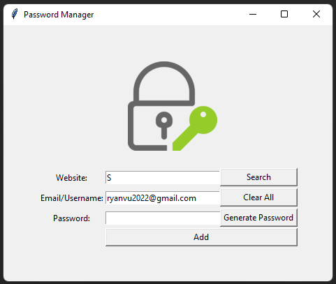

# password-manager
A password manager to generate (optional) and save password locally for personal use.  

The application is built with Python, Tkinter for GUI, and pyperclip.  
- User can fill in website, email/username(default with custom email) and password.
- Password can be filled manually or generated by clicking "Generate Password" button.
- When "Generate Password" button is clicked, pyperclip will automatically copy the password to clipboard.
- When "Add" button is clicked, info will be saved to a json file.
- "Add" button only works if none of three inputs is empty, otherwise a warning message will pop up.
- User can search for the username and password of a website:
  - If no data file is found, a message box will pop up: "No data file found"
  - If there is a data file but no website is found: a message box will pop up: "No detail for the website exists"
  - If there is a valid result, then a message box will pop up with information of email and password, and the password will be copied automatically to the clipboard.
- "Clear" button will clear all input boxes.

